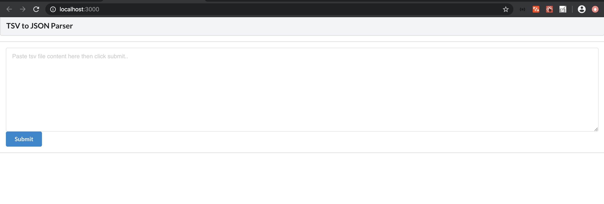
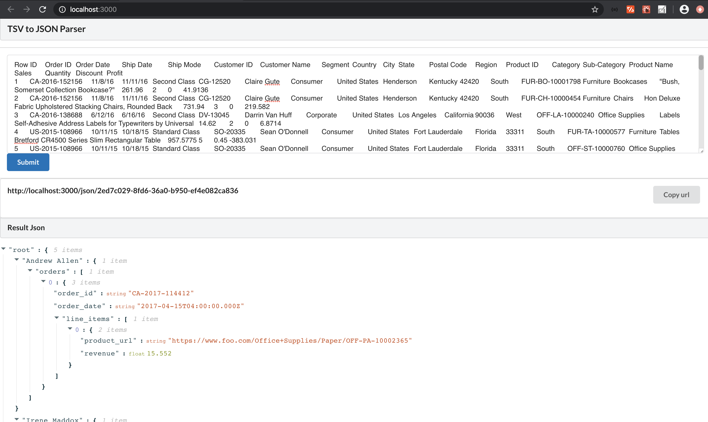
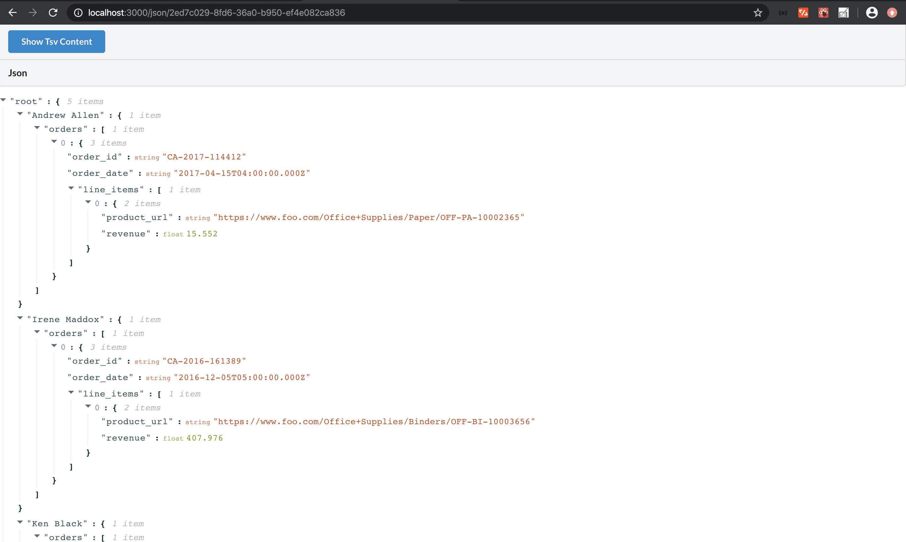
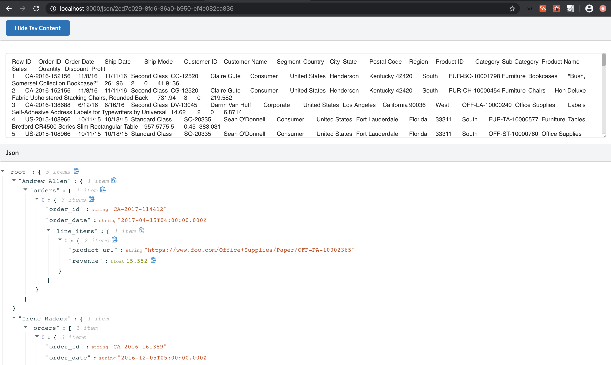

# React App for Tsv2Json Parser

## Pre-requisite :
   1. npm should be installed
   2. node should be installed
   3. install and run java backend project : https://github.com/shekharDivyanshu/tsv2jsonparser
   4. update following property in [ src/constants/constant.js ]
      TSV_API_HOST_PORT with host and port of the java project https://github.com/shekharDivyanshu/tsv2jsonparser
   
   
## Steps to build 
   1. npm install
   
## steps to run app 
   1. npm start

Open [http://localhost:3000](http://localhost:3000) to view it in the browser.

#### Test data [testdata/sampledata.tsv](testdata/sampledata.tsv)

### Initial Search Page : 

### Search page with tsv content and clicked submit 

### Search page with generated url and hidded tsv content 

### Search page with generated url and expanded tsv content

